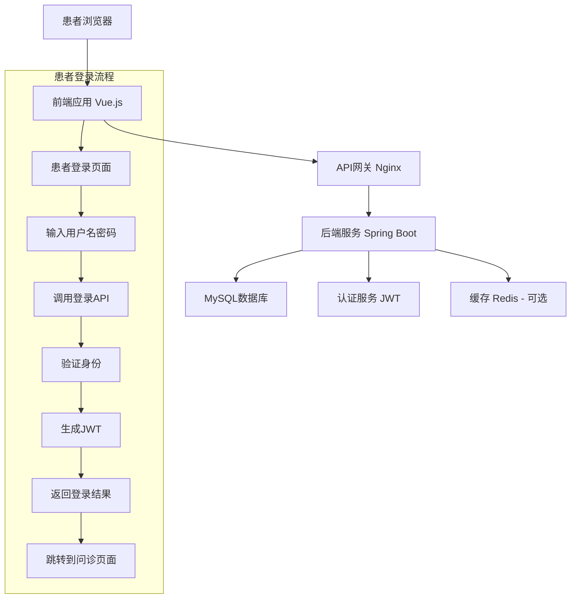

# 患者登录功能 PRD 文档

## 1. 概述
### 1.1 文档目的
本文档旨在定义医疗健康咨询平台的患者登录功能需求，为开发团队提供明确的功能规格和验收标准。

### 1.2 产品愿景
为患者提供安全、便捷的登录体验，建立用户账户体系，为后续个性化服务、历史记录查询等功能奠定基础。

### 1.3 项目背景
当前平台仅支持匿名问诊，无法为用户提供持续的服务体验。引入患者登录功能可实现：
- 用户身份认证和授权
- 个人健康信息保存
- 问诊历史记录
- 个性化推荐和服务

## 2. 项目目标
### 2.1 业务目标
1. 提升用户体验：通过账户系统提供个性化服务
2. 增加用户粘性：建立用户与平台的长效连接
3. 数据积累：收集和分析用户行为数据
4. 合规要求：满足医疗信息管理的安全规范

### 2.2 技术目标
1. 实现安全可靠的用户认证机制
2. 建立完善的用户数据模型
3. 提供灵活的API接口支持
4. 确保系统的可扩展性和高性能

### 2.3 成功指标（KPIs）
1. 用户注册转化率 ≥ 40%
2. 登录成功率 ≥ 98%
3. 登录平均响应时间 ≤ 500ms
4. 安全性：零重大安全漏洞

## 3. 用户画像
### 3.1 目标用户群体
- **问诊患者**：需要医疗咨询的用户，可能是慢性病患者、急性症状患者、健康咨询者等
- **家属代问诊**：为家人咨询的亲属
- **复诊用户**：需要定期咨询的患者

### 3.2 用户场景
| 用户类型 | 使用场景 | 核心需求 | 痛点 |
|---------|---------|---------|------|
| 慢性病患者 | 定期咨询病情进展 | 方便登录、历史记录查看 | 每次问诊需重复输入信息 |
| 急性症状患者 | 紧急医疗咨询 | 快速登录、及时响应 | 登录流程繁琐影响咨询效率 |
| 复诊用户 | 查看历史记录 | 账户安全、数据完整 | 担心个人信息泄露 |

## 4. 功能需求
### 4.1 核心功能
#### 功能1：患者登录
- **功能描述**：患者使用用户名和密码进行身份认证
- **用户故事**：作为问诊患者，我希望能够使用用户名和密码登录系统，以便查看我的历史问诊记录和获取个性化服务
- **验收标准**：
  1. 输入正确的用户名和密码，系统验证成功并跳转到问诊页面
  2. 输入错误的用户名或密码，系统显示明确的错误提示
  3. 登录状态持续到用户主动退出或会话过期
  4. 支持记住密码功能（可选）
  5. 登录失败超过5次后，账户暂时锁定15分钟

#### 功能2：登录状态管理
- **功能描述**：管理用户的登录状态和会话
- **用户故事**：作为已登录患者，我希望系统能够记住我的登录状态，以便在浏览不同页面时无需重复登录
- **验收标准**：
  1. 登录成功后，用户可以在各个页面间自由跳转
  2. 刷新页面后，登录状态保持不变
  3. 会话过期后，用户需重新登录
  4. 提供明确的登录/登出状态指示

#### 功能3：患者信息管理
- **功能描述**：查看和管理患者基本信息
- **用户故事**：作为注册患者，我希望能够查看和更新我的个人信息，以便保持信息的准确性
- **验收标准**：
  1. 登录后可以查看个人基本信息（姓名、联系方式等）
  2. 支持修改个人信息（邮箱、手机号等）
  3. 敏感信息修改需要验证身份
  4. 提供密码修改功能

### 4.2 非功能性需求
- **性能要求**：
  - 登录接口响应时间 ≤ 300ms（P95）
  - 支持并发登录用户数 ≥ 1000
  - 系统可用性 ≥ 99.9%
  
- **安全性要求**：
  - 密码必须加密存储（使用bcrypt/PBKDF2）
  - 防止SQL注入和XSS攻击
  - 登录请求需要防重放攻击
  - 敏感数据传输使用HTTPS
  
- **可用性要求**：
  - 登录界面符合无障碍标准
  - 提供清晰的错误提示
  - 支持响应式设计，适配移动端
  
- **兼容性要求**：
  - 支持主流浏览器（Chrome, Firefox, Safari, Edge）
  - 支持移动端浏览器

## 5. 系统架构
### 5.1 技术栈
- **前端**：Vue 3 + TypeScript + Vite + Ant Design Vue
- **后端**：Spring Boot 3.5.7 + Java 17 + Spring Data JPA
- **数据库**：MySQL 8.0（生产） / H2（开发）
- **认证**：JWT（JSON Web Token）
- **部署**：Docker + Docker Compose

### 5.2 架构图


## 6. 数据模型
### 6.1 核心实体
- **Patient**（患者）
  - id: Long（主键）
  - username: String（唯一，登录用户名）
  - password: String（加密密码）
  - name: String（真实姓名）
  - birthday: String（出生日期）
  - phone: String（联系电话）
  - gender: String（性别）
  - email: String（邮箱）
  - isActive: Boolean（是否活跃）
  - createdAt: LocalDateTime（创建时间）
  - updatedAt: LocalDateTime（更新时间）

- **LoginHistory**（登录历史）
  - id: Long（主键）
  - patientId: Long（患者ID）
  - loginTime: LocalDateTime（登录时间）
  - ipAddress: String（IP地址）
  - userAgent: String（用户代理）
  - status: String（登录状态：成功/失败）
  - failureReason: String（失败原因）

### 6.2 数据库设计
```sql
-- patients 表
CREATE TABLE patients (
    id BIGINT PRIMARY KEY AUTO_INCREMENT,
    username VARCHAR(50) UNIQUE NOT NULL,
    password VARCHAR(100) NOT NULL,
    name VARCHAR(100) NOT NULL,
    birthday DATE,
    phone VARCHAR(20),
    gender VARCHAR(10),
    email VARCHAR(100),
    is_active BOOLEAN DEFAULT TRUE,
    created_at TIMESTAMP DEFAULT CURRENT_TIMESTAMP,
    updated_at TIMESTAMP DEFAULT CURRENT_TIMESTAMP ON UPDATE CURRENT_TIMESTAMP,
    INDEX idx_username (username),
    INDEX idx_phone (phone),
    INDEX idx_email (email)
);

-- login_history 表
CREATE TABLE login_history (
    id BIGINT PRIMARY KEY AUTO_INCREMENT,
    patient_id BIGINT NOT NULL,
    login_time TIMESTAMP DEFAULT CURRENT_TIMESTAMP,
    ip_address VARCHAR(45),
    user_agent VARCHAR(500),
    status VARCHAR(20) NOT NULL,
    failure_reason VARCHAR(200),
    FOREIGN KEY (patient_id) REFERENCES patients(id) ON DELETE CASCADE,
    INDEX idx_patient_id (patient_id),
    INDEX idx_login_time (login_time)
);
```

## 7. API设计
### 7.1 RESTful API规范
- **基础URL**：`/api/patients`
- **HTTP方法**：
  - GET：获取资源
  - POST：创建资源
  - PUT：更新资源
  - DELETE：删除资源
- **状态码**：
  - 200：成功
  - 400：请求参数错误
  - 401：未授权
  - 403：禁止访问
  - 404：资源不存在
  - 500：服务器内部错误
- **响应格式**：
```json
{
  "success": true,
  "message": "操作成功",
  "data": {},
  "timestamp": 1234567890
}
```

### 7.2 核心接口
#### 7.2.1 登录接口
```
POST /api/patients/login
Content-Type: application/json

请求参数：
{
  "username": "string",  // 用户名
  "password": "string"   // 密码
}

成功响应：
{
  "success": true,
  "message": "登录成功",
  "data": {
    "token": "eyJhbGciOiJIUzI1NiIsInR5cCI6IkpXVCJ9...",
    "patient": {
      "id": "patient001",
      "username": "patient001",
      "name": "张三",
      "birthday": "1990-01-01",
      "phone": "13800138000",
      "gender": "男"
    }
  }
}

失败响应：
{
  "success": false,
  "message": "用户名或密码错误",
  "data": null
}
```

#### 7.2.2 获取当前患者信息
```
GET /api/patients/current
Authorization: Bearer <token>

成功响应：
{
  "success": true,
  "message": "获取成功",
  "data": {
    "id": "patient001",
    "username": "patient001",
    "name": "张三",
    "birthday": "1990-01-01",
    "phone": "13800138000",
    "gender": "男",
    "email": "zhangsan@example.com"
  }
}
```

#### 7.2.3 登出接口
```
POST /api/patients/logout
Authorization: Bearer <token>

成功响应：
{
  "success": true,
  "message": "登出成功",
  "data": null
}
```

## 8. 用户界面设计
### 8.1 页面列表
1. **患者登录页面**（路由：`/patient/login`）
   - 用户名/密码输入框
   - 登录按钮
   - "记住我"复选框
   - "忘记密码"链接
   - "注册新账户"链接
   - "直接进入问诊"按钮（跳过登录）

2. **患者个人信息页面**（路由：`/patient/profile`）
   - 个人信息展示
   - 编辑信息按钮
   - 修改密码表单

### 8.2 关键界面原型
#### 登录页面设计
```
+-----------------------------------+
|        医疗健康咨询平台           |
|           患者登录                |
+-----------------------------------+
|                                   |
|  用户名： [_______________]       |
|                                   |
|  密码：   [_______________]       |
|                                   |
|  [✓] 记住我                       |
|                                   |
|  [      登录      ]               |
|                                   |
|  [忘记密码？] [注册新账户]        |
|                                   |
|  [直接进入问诊]                   |
|                                   |
+-----------------------------------+
| 提示：测试账号 patient001/123456  |
+-----------------------------------+
```

## 9. 开发计划
### 9.1 阶段划分
#### 阶段1：MVP - 基础登录功能（预计2周）
- **任务1**：数据库表设计（patients表）
- **任务2**：后端登录API开发
- **任务3**：JWT认证实现
- **任务4**：前端登录页面开发
- **任务5**：登录状态管理
- **任务6**：单元测试和集成测试

#### 阶段2：增强功能（预计1周）
- **任务1**：记住密码功能
- **任务2**：登录历史记录
- **任务3**：账户安全策略（登录失败锁定）
- **任务4**：个人信息管理页面

#### 阶段3：优化和扩展（预计1周）
- **任务1**：性能优化（缓存、索引）
- **任务2**：多语言支持
- **任务3**：第三方登录（微信、支付宝）
- **任务4**：监控和日志完善

### 9.2 里程碑
| 里程碑 | 完成时间 | 交付内容 |
|--------|----------|----------|
| MVP 完成 | 2026-04-21 | 基础登录功能、API文档、测试用例 |
| 增强功能完成 | 2026-04-28 | 完整登录系统、安全策略、个人中心 |
| 项目上线 | 2026-05-05 | 生产环境部署、监控告警、用户手册 |

## 10. 测试策略
### 10.1 测试类型
- **单元测试**：测试各个Service、Repository、Controller的独立功能
- **集成测试**：测试API接口和数据访问层
- **端到端测试**：模拟用户完整登录流程
- **安全测试**：测试认证和授权的安全性
- **性能测试**：测试登录接口的性能和并发能力

### 10.2 测试用例
#### 测试场景1：正常登录
```
场景：患者使用正确的用户名密码登录
前置条件：患者已注册（username: patient001, password: 123456）
测试步骤：
1. 访问 http://localhost:5173/patient/login
2. 在用户名输入框中输入 "patient001"
3. 在密码输入框中输入 "123456"
4. 点击"登录"按钮
预期结果：
1. 显示"登录成功"提示
2. 页面跳转到问诊页面（/consultation）
3. 右上角显示当前患者信息
```

#### 测试场景2：密码错误
```
场景：患者使用错误的密码登录
前置条件：患者已注册（username: patient001）
测试步骤：
1. 访问登录页面
2. 输入用户名 "patient001"
3. 输入错误密码 "wrongpassword"
4. 点击"登录"按钮
预期结果：
1. 显示"用户名或密码错误"提示
2. 保持登录页面状态
3. 不跳转页面
```

#### 测试场景3：连续登录失败
```
场景：患者连续5次使用错误密码登录
前置条件：患者已注册（username: patient001）
测试步骤：
1. 连续5次使用错误密码登录
2. 第6次使用正确密码登录
预期结果：
1. 前5次显示错误提示
2. 第6次显示"账户暂时锁定，请15分钟后重试"
```

## 11. 部署方案
### 11.1 环境规划
- **开发环境**：
  - URL: http://localhost:5173
  - 数据库: H2内存数据库
  - 用途：开发者本地开发和调试
  
- **测试环境**：
  - URL: http://test.health-qa.com
  - 数据库: MySQL Docker容器
  - 用途：功能测试、集成测试
  
- **预生产环境**：
  - URL: http://staging.health-qa.com
  - 数据库: MySQL集群
  - 用途：性能测试、安全测试
  
- **生产环境**：
  - URL: https://health-qa.com
  - 数据库: MySQL主从集群
  - 用途：正式用户访问

### 11.2 部署流程
1. **开发阶段**
   - 开发者在本地环境完成功能开发
   - 提交代码到Git仓库
   
2. **持续集成**
   - 自动运行单元测试
   - 静态代码分析
   - 构建Docker镜像
   
3. **测试部署**
   - 自动部署到测试环境
   - 运行自动化测试
   - 人工验收测试
   
4. **生产部署**
   - 蓝绿部署或金丝雀发布
   - 监控系统性能
   - 回滚预案准备

## 12. 风险与应对
### 12.1 技术风险
- **风险**：JWT令牌安全性问题
  - **影响程度**：高
  - **应对措施**：
    1. 使用足够强的加密算法（HS256或RS256）
    2. 设置合理的令牌过期时间（建议2小时）
    3. 使用HTTPS传输令牌
    4. 实现令牌刷新机制

- **风险**：密码安全存储
  - **影响程度**：高
  - **应对措施**：
    1. 使用bcrypt或PBKDF2加密算法
    2. 设置足够的盐值长度和迭代次数
    3. 定期更换加密算法密钥

### 12.2 业务风险
- **风险**：用户隐私数据泄露
  - **影响程度**：高
  - **应对措施**：
    1. 遵守GDPR和HIPAA等数据保护法规
    2. 实施数据脱敏和权限控制
    3. 定期进行安全审计

- **风险**：登录体验复杂影响转化率
  - **影响程度**：中
  - **应对措施**：
    1. 提供一键登录选项
    2. 简化注册流程
    3. 提供多种登录方式（手机号、邮箱、第三方）

## 13. 附录
### 13.1 术语表
| 术语 | 定义 |
|------|------|
| JWT | JSON Web Token，用于身份验证的开放标准 |
| OAuth2 | 开放授权标准，用于第三方应用授权 |
| SSO | 单点登录，一次登录可访问多个应用 |
| 2FA | 双重验证，增加账户安全性的验证方式 |
| GDPR | 通用数据保护条例，欧盟数据保护法规 |
| HIPAA | 健康保险可携性和责任法案，美国医疗信息保护法规 |

### 13.2 参考资料
1. Spring Security官方文档
2. JWT RFC 7519标准
3. OAuth2.0 RFC 6749标准
4. 医疗信息系统安全规范
5. 用户隐私保护最佳实践

---

**文档版本历史**
| 版本 | 日期 | 作者 | 修改说明 |
|------|------|------|----------|
| v1.0 | 2026-04-14 | AI Assistant | 初稿：患者登录功能PRD |
| v1.1 | 2026-04-14 | AI Assistant | 完善API设计、测试用例和风险应对 |