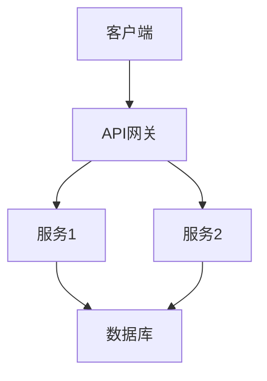

# PRD 文档模板

## 1. 概述
### 1.1 文档目的
说明本文档的编写目的和预期读者。

### 1.2 产品愿景
描述产品的长期目标和愿景。

### 1.3 项目背景
介绍项目背景、市场现状、用户痛点等。

## 2. 项目目标
### 2.1 业务目标
- 目标1：...
- 目标2：...
- 目标3：...

### 2.2 技术目标
- 目标1：...
- 目标2：...
- 目标3：...

### 2.3 成功指标（KPIs）
- 指标1：...
- 指标2：...
- 指标3：...

## 3. 用户画像
### 3.1 目标用户群体
- 用户类型1：...
- 用户类型2：...
- 用户类型3：...

### 3.2 用户场景
| 用户类型 | 使用场景 | 核心需求 | 痛点 |
|---------|---------|---------|------|
| 用户A | 场景描述 | 需求描述 | 痛点描述 |
| 用户B | 场景描述 | 需求描述 | 痛点描述 |

## 4. 功能需求
### 4.1 核心功能
#### 功能1：功能名称
- **功能描述**：...
- **用户故事**：作为[用户角色]，我希望[实现什么]，以便于[达到什么目的]
- **验收标准**：
  1. ...
  2. ...
  3. ...

#### 功能2：功能名称
- **功能描述**：...
- **用户故事**：...
- **验收标准**：...

### 4.2 非功能性需求
- 性能要求：...
- 安全性要求：...
- 可用性要求：...
- 兼容性要求：...

## 5. 系统架构
### 5.1 技术栈
- 前端：...
- 后端：...
- 数据库：...
- 部署：...

### 5.2 架构图


## 6. 数据模型
### 6.1 核心实体
- 实体1：属性列表
- 实体2：属性列表
- 实体关系：实体间关系描述

### 6.2 数据库设计
```sql
-- 表结构示例
CREATE TABLE users (
    id BIGINT PRIMARY KEY,
    username VARCHAR(50) UNIQUE NOT NULL,
    password VARCHAR(100) NOT NULL,
    created_at TIMESTAMP DEFAULT CURRENT_TIMESTAMP
);
```

## 7. API设计
### 7.1 RESTful API规范
- 命名规范：...
- 状态码：...
- 错误处理：...

### 7.2 核心接口
```
GET    /api/resource           # 获取资源列表
POST   /api/resource           # 创建资源
GET    /api/resource/{id}      # 获取单个资源
PUT    /api/resource/{id}      # 更新资源
DELETE /api/resource/{id}      # 删除资源
```

## 8. 用户界面设计
### 8.1 页面列表
- 页面1：页面名称（路由：/path）
- 页面2：页面名称（路由：/path）

### 8.2 关键界面原型
描述关键界面的布局和功能。

## 9. 开发计划
### 9.1 阶段划分
#### 阶段1：MVP（核心功能）
- 任务1：...
- 任务2：...
- 预期时间：X周

#### 阶段2：增强功能
- 任务1：...
- 任务2：...
- 预期时间：Y周

### 9.2 里程碑
| 里程碑 | 完成时间 | 交付内容 |
|--------|----------|----------|
| 里程碑1 | YYYY-MM-DD | 内容描述 |
| 里程碑2 | YYYY-MM-DD | 内容描述 |

## 10. 测试策略
### 10.1 测试类型
- 单元测试：...
- 集成测试：...
- 端到端测试：...
- 性能测试：...

### 10.2 测试用例
```
测试场景：用户登录
前置条件：用户已注册
测试步骤：
1. 访问登录页面
2. 输入用户名和密码
3. 点击登录按钮
预期结果：登录成功，跳转到首页
```

## 11. 部署方案
### 11.1 环境规划
- 开发环境：...
- 测试环境：...
- 预生产环境：...
- 生产环境：...

### 11.2 部署流程
1. 代码审查
2. 自动化测试
3. 构建打包
4. 部署到测试环境
5. 验证测试
6. 部署到生产环境

## 12. 风险与应对
### 12.1 技术风险
- 风险描述：...
- 影响程度：高/中/低
- 应对措施：...

### 12.2 业务风险
- 风险描述：...
- 影响程度：高/中/低
- 应对措施：...

## 13. 附录
### 13.1 术语表
| 术语 | 定义 |
|------|------|
| 术语1 | 定义描述 |
| 术语2 | 定义描述 |

### 13.2 参考资料
- 参考文档1
- 参考文档2

---

**文档版本历史**
| 版本 | 日期 | 作者 | 修改说明 |
|------|------|------|----------|
| v1.0 | YYYY-MM-DD | 作者 | 初稿 |
| v1.1 | YYYY-MM-DD | 作者 | 更新功能需求 |